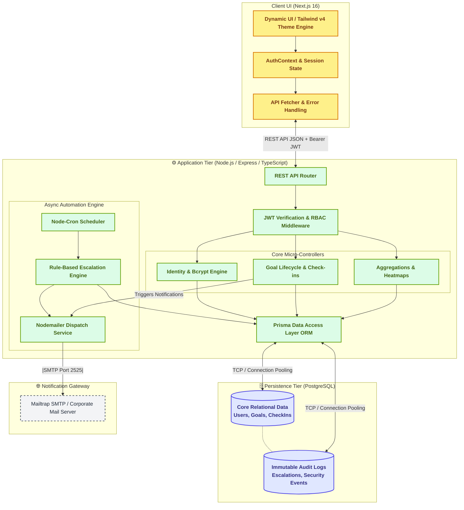

#Atomquest

```mermaid
flowchart TB
    %% Styling Definitions
%%  classDef actor fill:#e0f2fe,stroke:#2563eb,stroke-width:2px,color:#1e3a8a,font-weight:bold
    classDef frontend fill:#fef08a,stroke:#d97706,stroke-width:2px,color:#78350f,font-weight:bold
    classDef backend fill:#dcfce7,stroke:#65a30d,stroke-width:2px,color:#3f6212,font-weight:bold
    classDef database fill:#e0e7ff,stroke:#4f46e5,stroke-width:2px,color:#312e81,font-weight:bold
    classDef external fill:#f3f4f6,stroke:#4b5563,stroke-width:2px,color:#1f2937,stroke-dasharray: 5 5

    %% Actor Layer

    %% Client/Presentation Tier
    subgraph ClientTier ["Client UI (Next.js 16)"]
        direction TB
        UI[Dynamic UI / Tailwind v4 Theme Engine]:::frontend
        State[AuthContext & Session State]:::frontend
        Fetcher[API Fetcher & Error Handling]:::frontend

        UI --> State
        State --> Fetcher
    end

    %% API/Application Tier
    subgraph AppTier ["⚙️ Application Tier (Node.js / Express / TypeScript)"]
        direction TB
        APIGateway[REST API Router]:::backend
        Security[JWT Verification & RBAC Middleware]:::backend

        subgraph BusinessLogic ["Core Micro-Controllers"]
            direction LR
            AuthSvc[Identity & Bcrypt Engine]:::backend
            GoalSvc[Goal Lifecycle & Check-ins]:::backend
            AnalyticSvc[Aggregations & Heatmaps]:::backend
        end

        subgraph BackgroundProcess ["Async Automation Engine"]
            Cron[Node-Cron Scheduler]:::backend
            Escalation[Rule-Based Escalation Engine]:::backend
            EmailSvc[Nodemailer Dispatch Service]:::backend

            Cron --> Escalation
            Escalation --> EmailSvc
        end

        DAL[Prisma Data Access Layer ORM]:::backend

        APIGateway --> Security
        Security --> AuthSvc & GoalSvc & AnalyticSvc
        GoalSvc -- Triggers Notifications --> EmailSvc
        AuthSvc & GoalSvc & AnalyticSvc --> DAL
        Escalation --> DAL
    end

    %% Data Tier
    subgraph DataTier ["🗄️ Persistence Tier (PostgreSQL)"]
        direction TB
        PG[(Core Relational Data\nUsers, Goals, CheckIns)]:::database
        Audit[(Immutable Audit Logs\nEscalations, Security Events)]:::database

        PG -.- Audit
    end

    %% External Integrations
    subgraph External ["🌐 Notification Gateway"]
        SMTP[Mailtrap SMTP / Corporate Mail Server]:::external
    end

    %% Network Connections
    Fetcher <-->|REST API JSON + Bearer JWT| APIGateway

    EmailSvc --|SMTP Port 2525|--> SMTP

    DAL <-->|TCP / Connection Pooling| PG
    DAL <-->|TCP / Connection Pooling| Audit
```